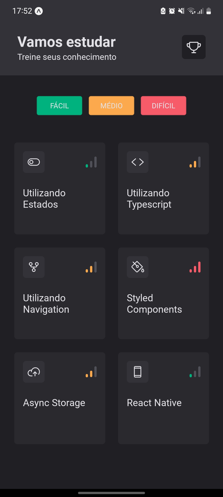
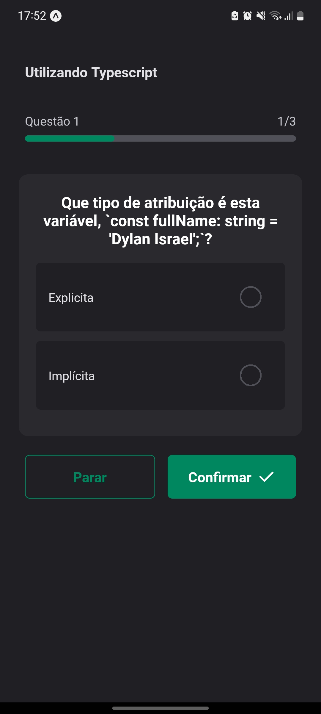
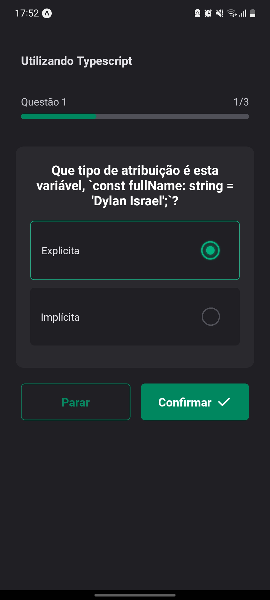
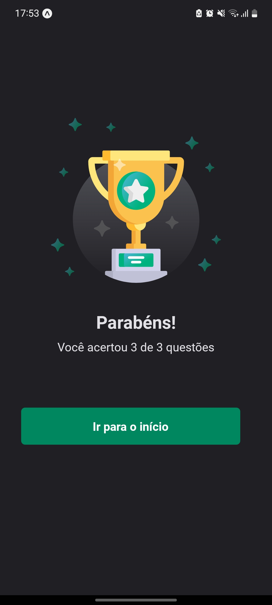
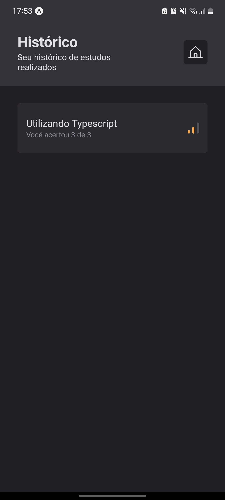
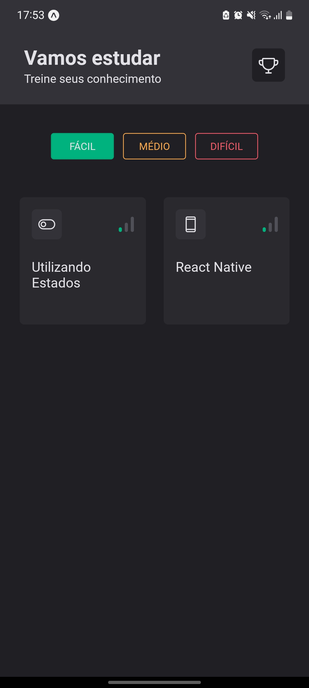

# Rocket Quiz - Ignite | Rocketseat

## Português

#### Aplicativo de perguntas e respostas

Na aplicação, com as interfaces já prontas, adicionou-se animações e microinterações com react native reanimated, react native gesture handler, react native skia, expo av e expo haptics.

## English

#### Question and answer application.

In the application, with the interfaces already built, animations and microinteractions were added using React Native Reanimated, React Native Gesture Handler, React Native Skia, Expo AV, and Expo Haptics.

## Screenshots

    

        
        
        
        
        
        
    

## Video

https://user-images.githubusercontent.com/86618257/236331875-95e30bd6-dd24-42ba-bd17-51e02d59f58d.mp4

## Stack

 
